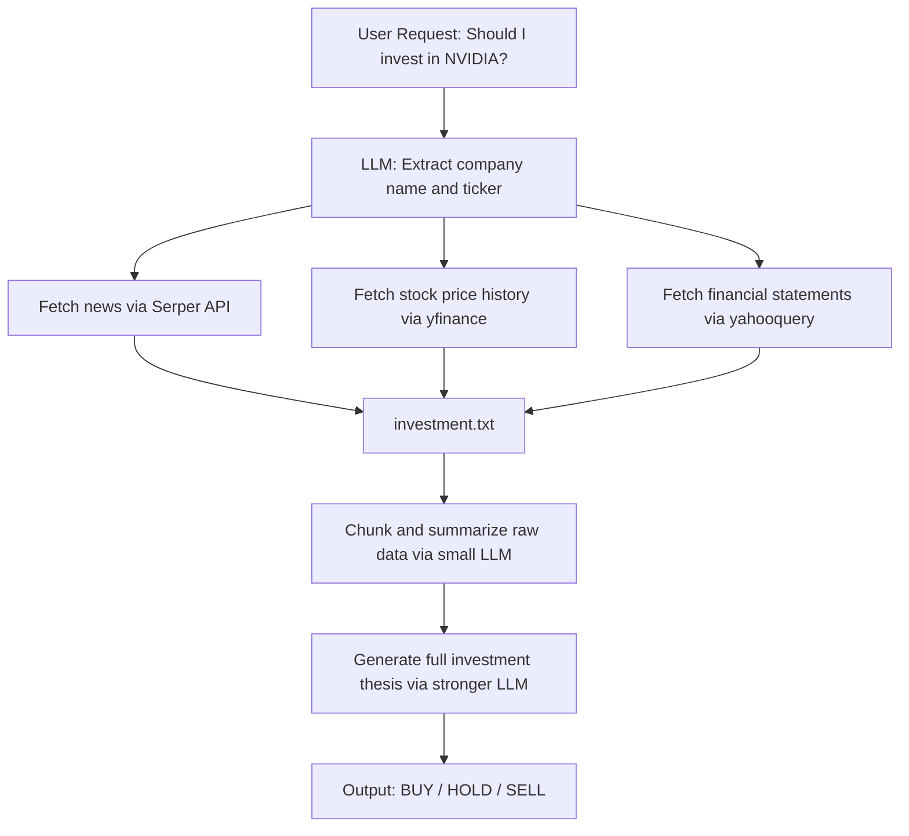

# AI Financial Analyst

An AI agent that turns a plain-English question like *"Should I invest in NVIDIA?"* into a full HTML investment thesis — complete with company news, financial statements, bull/bear cases, and a final **BUY / HOLD / SELL** recommendation.

It combines:
- **Groq** (fast LLM inference, running open-weight models like Llama 3.1/3.3)
- **Serper API** (Google News search)
- **yfinance** + **yahooquery** (stock price history and financial statements)

---

## Table of Contents
- [Why This Exists](#why-this-exists)
- [Design Thought Process](#design-thought-process)
- [Architecture Overview](#architecture-overview)
- [Step-by-Step Pipeline](#step-by-step-pipeline)
- [Setup](#setup)
- [Usage](#usage)
- [Model Choices](#model-choices)
- [Known Limitations](#known-limitations)
- [Demo Output](#demo-output)

---

## Why This Exists

Writing an equity research note normally means manually pulling news, digging through balance sheets, and synthesizing it all into a coherent narrative. This project automates that pipeline end-to-end: **one natural-language question in, one structured HTML thesis out.**

It's intentionally built on free/cheap infrastructure (Groq's open-weight model hosting, free-tier search API) so it's easy to run and extend without a heavy API bill.

---

## Design Thought Process

A few decisions shaped how this is built, and the reasoning behind each:

**1. Separate "data collection" from "reasoning."**
Financial data (news, prices, statements) is fetched and dumped to a flat text file *before* any LLM ever sees it. This keeps the data-gathering layer dumb, debuggable, and swappable — you can inspect `investment.txt` directly to sanity-check what the model is working from, independent of how well it writes the final report.

**2. Treat the LLM context window as a scarce resource.**
A year of daily stock prices plus full financial statements plus news articles easily blows past what's comfortable to send in one prompt — and past Groq's free-tier token-per-minute limits. Rather than truncating data blindly (and losing potentially important figures), the pipeline **chunks the raw text and summarizes each chunk first**, distilling everything down to key numbers before the "real" reasoning step ever runs. Think of it as taking notes chapter-by-chapter before writing the final essay.

**3. Match model size to task difficulty.**
Not every LLM call needs the same horsepower:
- Extracting a ticker symbol from a sentence → trivial, small model is fine.
- Summarizing a chunk of raw financial text into bullet points → mechanical extraction, small model is fine.
- Synthesizing all of that into a 13-section thesis with bull/bear reasoning and a recommendation → this is the step that actually benefits from a stronger model.

This is a deliberate cost/quality tradeoff: cheap and fast where the task is mechanical, more capable where judgment is required.

**4. Fail gracefully, not silently.**
Financial data sources are inconsistent — not every ticker has clean cash flow data, not every company has recent news. Every external call (API requests, `yfinance`, `yahooquery`) is wrapped in `try/except` so a single missing data point (e.g. no cash flow statement) degrades to `"N/A"` instead of crashing the whole run.

---

## Architecture Overview


 
---

## Step-by-Step Pipeline

### 1. Parse the request → company + ticker
`financial_analyst()` sends the user's raw question to the LLM using **function calling**, forcing a structured JSON response (`{"company_name": ..., "company_ticker": ...}`) instead of free text. This makes downstream steps reliable — no regex-parsing a sentence to guess the ticker.

### 2. Collect raw data — `get_data()`
Orchestrates three independent fetchers, all writing into a single file (`investment.txt`):

| Function | Source | What it grabs |
|---|---|---|
| `get_company_news()` | Serper API | Recent news headlines, links, dates |
| `get_stock_evolution()` | `yfinance` | Historical price data (default: 1 year) |
| `get_financial_statements()` | `yahooquery` | Balance sheet, cash flow, income statement, valuation measures |

The file is overwritten at the start (clean slate per run) and then appended to as each fetcher runs.

### 3. Compress the data — `summarize_in_chunks()`
The combined file can be huge — too large to fit an LLM's per-minute token budget. This function:
1. Splits the raw text into ~3,500-character chunks
2. Sends each chunk to a fast/cheap model, asking it to extract only key numbers and facts as bullet points
3. Concatenates the mini-summaries
4. Trims the result to a safe character budget

### 4. Generate the thesis
The condensed summary, plus a system prompt defining 13 required sections (Company Overview, Revenue Analysis, Risks, Bull Case, Bear Case, Final Recommendation, etc.), is sent to the LLM to produce the final HTML report.

### 5. Return the result
`financial_analyst()` returns `(thesis_html, hist)` — the HTML thesis plus the raw price-history DataFrame, so you can render the report and/or plot the price data independently.

---

## Setup

```bash
git clone <your-repo-url>
cd <your-repo>
pip install -r requirements.txt
```

Create a `.env` file in the project root:

```env
SERP_API_KEY=your_serper_api_key
GROQ_API_KEY=your_groq_api_key
```

- Get a Serper key at [serper.dev](https://serper.dev)
- Get a Groq key at [console.groq.com](https://console.groq.com)

---

## Usage

```python
from financial_analyst import financial_analyst

result = financial_analyst("Should I invest in NVIDIA?")

if result:
    thesis_html, price_history = result
    with open("thesis.html", "w") as f:
        f.write(thesis_html)
else:
    print("Analysis failed.")
```

Or run the script directly:

```bash
python financial_analyst.py
```

---

## Model Choices

All models currently used are served via Groq and are open-weight (no proprietary models like GPT or Claude are used).

| Step | Model | Why |
|---|---|---|
| Ticker extraction | `llama-3.1-8b-instant` | Trivial task, fast + cheap |
| Chunk summarization | `llama-3.3-70b-versatile` | Runs in a loop, mechanical extraction, cost matters |
| Thesis generation | `llama-3.3-70b-versatile` | Needs stronger reasoning for synthesis and recommendation quality |

> **Recommendation:** for the thesis-generation step, use a larger open-weight model such as `llama-3.3-70b-versatile` or `openai/gpt-oss-120b` (both available on Groq's free tier, rate-limited rather than paywalled). Verify current model IDs and free-tier limits against [Groq's docs](https://console.groq.com/docs/models), since these change over time.

---

## Known Limitations

- **Missing `model=` on the final thesis call.** The second Groq API call (thesis generation) currently doesn't specify a model, which will error against Groq's API. This needs to be set explicitly.
- **No retry/backoff on rate limits.** A `429` (rate limit exceeded) on any LLM call currently fails the whole run rather than retrying.
- **Single-ticker only.** No support for batch analysis of multiple companies in one run.
- **No caching.** Re-running for the same company re-fetches and re-summarizes everything from scratch.
- **Not financial advice.** Output is AI-generated and should be treated as a research starting point, not investment guidance.

---

## Demo Output

https://github.com/user-attachments/assets/8edf3c4e-7143-4b43-b693-e105ab382187

---
